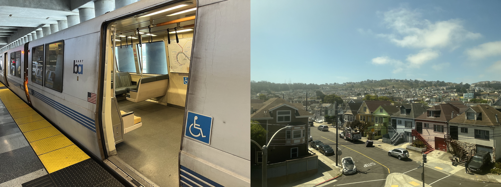
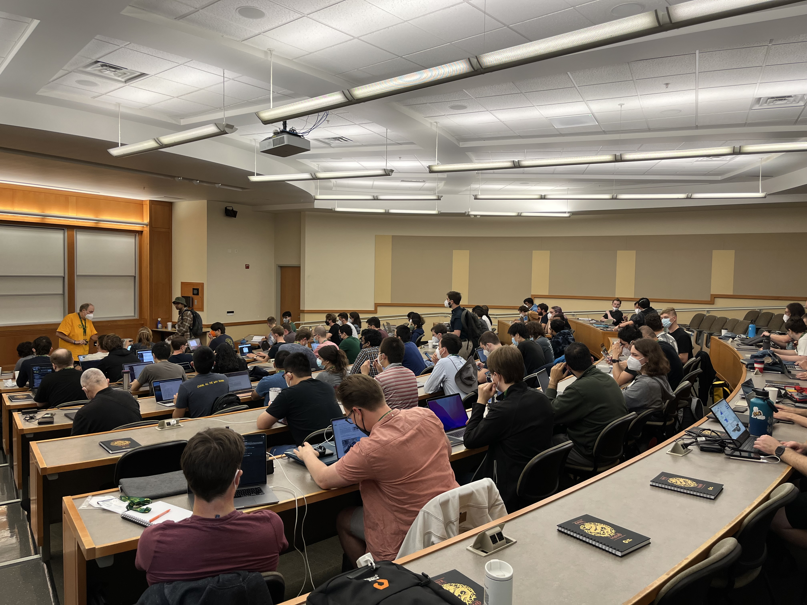
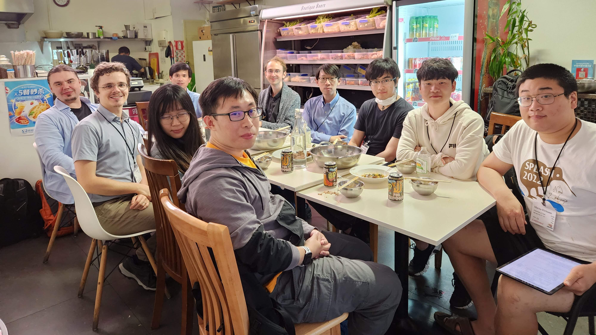
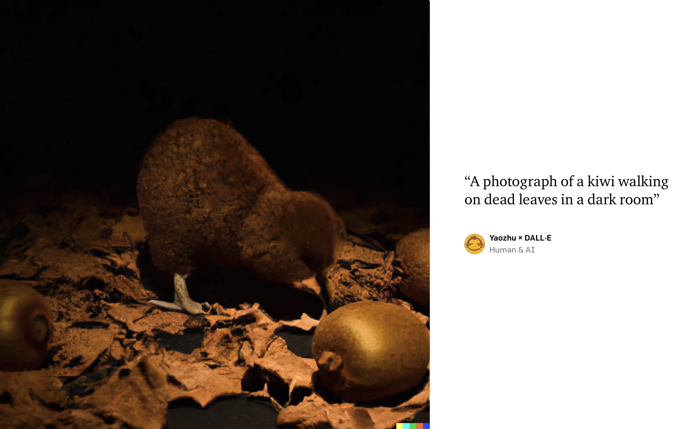

2019 年我初到香港，当时反送中运动愈演愈烈，尤其是亲历了十一之后港铁瘫痪、双十一前后港大校园被占领，我以为那已经是最糟糕的时代了。没想到 2020 年结束元旦假期从冲绳回香港，便听见机场广播呼吁旅客警惕武汉出现的不明肺炎，从此新冠疫情大幕拉起，我再也没有机会出过国。香港一直被定位为「[亚洲国际都会](https://www.brandhk.gov.hk/zh-cn/)」，但在这与世隔绝的两年多里，这个名号怕是要拱手让人了。不过随着两岸三地先后放弃清零政策，现在终于有了与全世界重新连接的感觉，我去年也有幸踏着疫情的尾巴去美国和新西兰开了会，在这里浅浅纪念一下我的学术首航暨首次跨洲旅行。

<!--more-->

## Pre-OPLSS'22 @ 旧金山湾区 🇺🇸

OPLSS 是一年一度在俄勒冈大学举办的编程语言暑校，虽然名字叫暑校，但主办方叮嘱我们这实际上是一个学术会议，别叫美国边检找我们要 F-1 签证。说到签证，我办 B-1 签证的经历也算是一波三折：首先是 2022 年初香港爆发了第五波疫情导致美领馆暂停了签证预约，虽然在我收到 OPLSS 申请结果前不久美领馆恢复了服务，但上网预约的时候才发现最近的签证面谈已经排到 OPLSS 开幕之后了……既然都申请到了能覆盖食宿的奖学金我们也不想乖乖放弃，就在已经开始研究怎么去新加坡面签的时候，我刷新美签网站恰好发现美领馆放出了更多面签名额，大概是正好赶上了他们从有限服务转为正常服务，于是我立刻预约了最早的 5 月 2 日。那天上午本来应该八点开始，结果在里面干等了半个小时签证官们才姗姗来迟，轮到我签证官问了一系列常规问题便发给我一张黄纸，上面写着根据美国移民和国籍法 221(g) 条款我的签证申请未能通过，也就是俗称的「check」。跟黄纸一起给我的还有一份 DS-5535 表格，叫我填完跟其他材料一起交到另一个窗口去，我一看这表我要填挺久而且我也没准备在学证明和行程单，悲从中来，就直接回家了。正坐着叮叮车呢，突然美领馆一个电话打过来问我去哪儿了，我说我先回家准备材料过会儿再过来，她一时语塞然后让我别来了直接邮件联系吧，我就发邮件补交了材料。第二天另外两位 OPLSS 同伴去面签，结果没问几个问题就当场批了十年签，这下我更难过了。不过好在我也没伤心太久，5 月 19 日美领馆就通知我签证通过了，远远早于我的预期，我悬着的心终于可以放下了。拿到护照一看，不出所料，是一年签。

因为机票买得有点晚，而且香港当时还没放弃清零政策，飞到美国西海岸并没有什么实惠的选择。想着可以先去太平洋另一边的湾区看看，我最终买了国泰航空直飞旧金山的航班，单程就花了一万港元。同样是直飞十一二个小时，后来去新西兰往返我也才花了一万港元，由于清零政策执行期间港大不鼓励出境也不给报销，摸摸钱包还有点心疼的。

时间快进到 6 月 15 日凌晨，我坐上了前往美国的飞机，在穿越了国际日期变更线之后，我在 6 月 14 日夜晚抵达了旧金山机场。如果要问我对美国的初印象，我一定会回忆起那破破旧旧的 BART 以及列车上神神叨叨向我要钱的流浪汉。在去旧金山市区的路上眺望窗外，湾区的景色确实与香港大相径庭：远处是矮矮的山丘，从山上延伸到山下，大大小小的联排别墅平铺在眼前。

我在旧金山湾区的四天行程是那种一眼看出是第一次来的类型：第一天坐地面缆车去九曲花街，再走到渔人码头坐船欣赏金门大桥（海上风好大好冷），最后去唐人街尝了中餐馆（遍地在说粤语）；第二天坐 MUNI 轻轨（怎么别人都没付钱？）去金门公园参观加州科学院（其实是个博物馆），顺便去日本茶园（据说是美国幸运饼干的起源）喝下午茶；第三天坐加州列车去帕罗奥图游览斯坦福校园；第四天浏览电脑历史博物馆（挺无聊的）和苹果新总部（在外围绕了一圈也没见哪儿能进园区）。

因为日程安排合不上，我的两位 OPLSS 同伴都还在香港，所以我联系了大学同学后两天借住在他家（的沙发上）。不过他在暑期实习有点忙，因此计划中还是我独自旅行，然而一个人玩到底还是有些寂寞，于是我在第三天去斯坦福的路上下定决心拨通了高中同学的电话。本来这种事情应该更早联系才对，但我迟迟不好意思麻烦更多同学，现在突然闯进别人的生活反而事与愿违了。没想到奇迹发生了，那天是工作日他竟然正好不上班，令人感动的是他还开车过来陪我逛了他的母校斯坦福。回去的路上，乘高中同学的车驰骋在一马平川的宽阔公路上，晴空万里之下远处的圣克鲁斯山脉依稀可辨，恍惚间自己也领会了同学们的美国梦。不论是高中同学租的联排别墅，还是大学同学租的单人公寓，都让我亲眼见识了硅谷人的奢华生活。

虽然早就听说美国大城市的治安臭名昭著，比如旧金山砸车窗盗窃相当猖獗，但这几天只在游客区和硅谷近郊活动，旅游体验还是不错的。旧金山的公共交通差强人意，而出了市区没车确实寸步难行，我全得仰赖同学接送。据说有些富人区甚至抵制公共交通，怕把流浪汉送到自己家门口……第一次来美国，还是独自出行，能如此顺利真得多谢拨冗接待我的同学们！

## OPLSS'22 @ 尤金 🇺🇸

从圣何塞飞尤金，西南航空竟然是自由席，机上座位先到先得，真是一上来就给了我一点小小的美国震撼。因为航司不认可港科大同伴的智克威得疫苗，所以他临时改了航班，在打车去俄勒冈大学的路上，我们三位来自香港的手足才终于会合。入住宿舍之后，我们遇见了三位交大出身赴美留学的中国同胞，后来还有一位竺院院友加盟，接下来的两周里我们几乎都是一起行动，结下了深厚的友谊。

OPLSS 经历了 2020 年停办、2021 年改为线上之后，终于在 2022 年回到了俄勒冈小城尤金。跟旧金山和洛杉矶相比，尤金十分宁静安全，除了爆表的花粉量放倒了好几位参会者。好巧不巧，这年正好撞上推迟了一年、首次在美国举行的田径世锦赛，而我们的宿舍就在比赛场馆海沃德田径场旁边，暑校结束再过两周就是比赛日。除了声势浩大的世锦赛，OPLSS 第一周后半还和美国室外田径锦标赛重合了，不过这个比赛规模相对不大，对我们没有什么影响，除了食堂更挤了一些。在校园里还不时能见到俄勒冈大学的吉祥物，长着特别像唐老鸭，上网一查发现还真拿到了迪士尼公司的正式授权。为了筹备世锦赛，暑校的第二周校园开始封路了，我们被迫从法学院宽敞明亮的大教室（如图）换到了数学系拥挤闷热的小教室，不知道是不是还有长时间佩戴 N95 口罩的原因，我第二周上课昏昏欲睡。

言归正传，OPLSS 的讲师阵容可谓众星云集，尽管至少有一半的内容我没听懂，但还是收获颇丰：Thorsten Altenkirch 用 Agda 讲解 [依值类型]{dependent types}，Jeremy Gibbons 探寻 [[神奇态射在哪里]{Fantastic Morphisms and Where to Find Them}](https://arxiv.org/pdf/2202.13633.pdf)，Pierre-Louis Curien 介绍 [博弈语义]{game semantics}，Silvia Ghilezan 介绍 λ 演算相关的基础知识，Paul Downen 介绍 [抽象机语义]{abstract machine semantics} 和 [经典逻辑的可实现性]{classical realizability}，Adam Chlipala 分享 Coq 实战经验，Steve Zdancewic 用软件基础的风格介绍 [[交互树]{Interaction Trees}](https://github.com/DeepSpec/InteractionTrees)，Sam Lindley 为 [代数效应]{algebraic effects} 传道，Stephanie Balzer 讲 [会话类型]{session types} 入门，Robert Harper 讲 [逻辑关系]{logical relations} 入门。而我最推荐的两门课要数 Frank Pfenning 的证明论入门和 Stephanie Weirich 的 [[Π∀]{pi-forall}](https://github.com/sweirich/pi-forall) 语言实现：证明论入门涵盖了逻辑和谐（也就是局部可靠性和完备性）、柯里–霍华德同构、自然演绎和相继式演算的对比、切消定理、线性逻辑等等，属实是帮我恶补了数理逻辑的知识；Π∀ 则是一门小巧的依值类型语言，用 Haskell 实现双向类型检查、Π 类型和 ∀ 类型（区别是运行时是否擦除参数）、依值的模式匹配、相等命题等等，这门课跟我们组的研究最接近所以倍感亲切。

## Post-OPLSS'22 @ 洛杉矶 🇺🇸

OPLSS 落幕之后，港大同伴有事先行回港了，而我和港科大同伴一起飞去洛杉矶开启了快乐的南加州之旅。~~因为也玩不出什么新花样，就还简单来个流水账加照片拼图吧：~~第一天我们去洛杉矶会展中心参加了号称北美最大的漫展 Anime Expo，然后坐公交车去市中心参观了小东京；第二天则是去圣莫尼卡海滩和比弗利山庄闲逛，感受美国独立日的气氛；第三天一整天畅玩好莱坞环球影城。

我们回港的航班坐的是大韩航空，不仅餐食是韩国传统的拌饭，而且起飞前播的安全宣传片是韩国男团 SuperM 一边唱跳 K-pop 一边讲安全须知，着实令人耳目一新。快乐的时光是短暂的，回到香港一落地等待着我们的就是七天的强制酒店隔离。回忆起这二十多天的美国之行，我最怀念的是在尤金最后一晚聚会 Texas Roadhouse 餐前的免费面包，好想再尝一次！

## SPLASH'22 @ 奥克兰 🇳🇿

一转眼到了年底，这届 SPLASH 在新西兰第一大城市奥克兰举办，是有史以来首次来到亚太地区。因为囊括了 OOPSLA、APLAS 以及其他并设的大大小小的会议，SPLASH 同时征用了八间会议室，持续一周时间。港府在九月已经取消了入境人员的强制隔离，香港这里大家都选择了飞去奥克兰参会，其中我们实验室去了四位，港科大也去了四位；或者按照参会目的来分，四位发表 OOPSLA 论文，两位发表 APLAS 论文，两位参加 ACM 学生科研竞赛。这次也是我人生第一次在线下面对观众发表论文，说实话蛮紧张的。

比起 OPLSS 上结识新伙伴的新鲜感，SPLASH 上更多的是见到久仰大名的学术大咖的激动，比如十四亿中国人的 PL 引路人[雾雨魔理沙](https://www.zhihu.com/people/marisa.moe)、当年[清华 FP 课](https://fp19.paulz.me)的灵魂人物[朱俸民](https://paulz.me)和[王程鹏](https://wcphkust.github.io)、还有[悠悠老师](https://prg.is.titech.ac.jp/people/cong/)和[宁宁学姐](https://xnning.github.io)。学术会议作为一种社交活动，当然绝不仅仅是发表论文，拓宽学术圈的人脉也是重要的一环。不过因为老布没来，不太敢随便向大教授们搭话，我们多半是跟华人学生聊天，比如来自澳洲和星洲的同行们。比较有意思的是我在宿舍食堂遇见了来自东工大的日本同学们，五年前我在他们实验室交换留学过，虽然那时候他们还不在，但大概也算是我的同门师弟了。后来我们在和港科大的🦁️老师一起聚餐时（如图）还认识了来自新国大的李曼努老师，他是奥地利人但会讲汉语，不仅在厦门大学读了中国哲学硕士，还在杭州阿里云实习过，让我感到十分惊奇。奥克兰市中心的皇后街两侧遍地都是亚洲餐馆，说街上半数是亚洲人也毫不夸张；不过即使在天空塔附近也有不少店面空铺招租，疫情之下的不景气可见一斑。

为了免除近千美元的会议注册费（这次还额外免了住宿费），我申请当了学生志愿者，但没想到志愿者会忙到几乎每天都有活要干。我们这次每人要负责五段会议（每段一个半小时）、一次午餐、半天的注册台接待以及一天待机随叫随到（结果我第一天一大早被叫去了注册台 🤦），虽然错过了几篇想听的论文，但接待了来自天南海北的学术同行们，还与 OPLSS 上就见过的来自麦吉尔的 Breandan 重逢了。此外也很推荐刚刚开始或者即将攻读 PL 研究生、对自己未来生活感到迷茫的同学参加大会并设的 PLMW，这个研讨会的定番是美国东北大学的 Amal Ahmed 教授教大家如何优雅地度过自己的博士生涯，这届还有嘉宾座谈会以及分小组轮流向教授提问的车轮战环节。

因为有志愿者任务我错过了霍比屯的组队游，最后只去了奥克兰动物园和水族馆。既然来了新西兰，最大的愿望当然是看看国鸟鹬鸵（几维鸟），它们在动物园有一栋专门的暗室，只有在固定的喂食时间才能一睹真容。可惜的是我当时在现场没拍到照片，于是我尝试用 OpenAI 的 DALL·E 合成了一张（如图）。虽然细节上有好多破绽，以及莫名其妙出现了猕猴桃，但乍一看还真像回事儿。

如今社交逐步复常但疫情仍在继续，一周的会议跟生存游戏一样，我们眼睁睁地看着香港一起来的同学接二连三地倒下了，平时一起吃饭的小伙伴们越来越少。为了预防中招，SPLASH 开幕半个月前我就拉着室友打了复必泰加强针，可喜可贺的是我们双双挺过了会议的一周。然而在回程的飞机上，我左右邻座咳嗽声鼻涕声不断，更糟糕的是新西兰航空不要求佩戴口罩，于是我就这样和他们密切接触了十一个小时。我的落地核酸是阴性，然而两天后的强制核酸变成了阳性，我也赶在 2022 年结束之前体验了一把竹篙湾隔离之旅，香港队八个人最后的战绩是六阳二阴。
