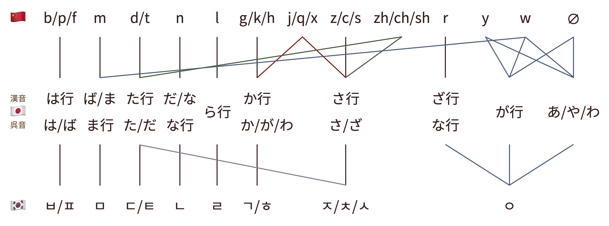

最近学习了上海外国语大学朱磊老师的《[中国传统音韵学](https://icourse163.org/course/SHISU-1003361045)》，拿到了成绩优秀的[认证证书](https://www.icourse163.org/cert/Authority.htm?certNo=V232334000003)，课程内容让我受益匪浅。传统上韵书是为文人写诗押韵作参考用的，不过我更感兴趣的是韵书所揭示的中古汉语读音哺育了不少域外方音，比如日语和韩语的汉字音。「久别重逢的乡音」便是摘自课程最后一讲的标题，而我想反过来从普通话与日韩汉字音的对应关系出发，印证一下中古汉语的本源地位，顺便介绍一下从中古汉语切韵音到现代汉语普通话发生了哪些重大变化。这既是我的学习笔记，也算是之前《[跨越国境的汉字](../cjkv/)》的续篇了。

<!--more-->

- 目录
{:toc}

## 声母

事不宜迟，我先画了一张现代中日韩汉字音的声母对应简图，可以直观地感受到三者的关系：

虽然乍一看有些凌乱，但大多数声母的对应关系都是有规律可循的；尤其是日语吴音和韩语汉字音，不考虑清浊和送气与否的话，可以说是对应得相当整齐了。两处分歧是近代朝鲜语的变化导致的：

1. 本来以ㄷ/ㅌ为声母、以ㅣ为介音的字，腭化成了以ㅈ/ㅊ为声母的字；
2. 原本最后几列对应的四个声母ㅿ/ㆁ/ㆆ/ㅇ，全部归入零声母ㅇ。

另外还有一点不自然的地方是日语的は行并不对应韩语的ㅎ或是汉语拼音的 h，这是因为日语发生过「は行転呼」这一重大语音变化：奈良时代以前的は行读如现代日语的ぱ行，然后经过一系列演变，一直到江户时代才变成现在的发音。所以当时は行对应于ㅂ/ㅍ，相对而言か行才更接近ㅎ。

这下问题来了，明明日本和朝鲜半岛都是从中国借入的汉字，为什么从声母对应关系来看汉语普通话反而差得更远呢？原因很简单——日本和朝鲜半岛借入的主要是中古汉语，而中古汉语到现代汉语的变化要远大于日语和韩语的变化。

汉字传入朝鲜半岛的时间有待考证，有上古音说、切韵音说、唐代长安音说、宋代开封音说等；而汉字读音传入日本的时间跨度较大，至少可以分为三波：

1. **吴音**是从南朝传入的金陵雅音，比如「[京]{きょう}都」；
2. **汉音**是由遣唐使习得的长安音，比如「[京]{けい}阪神」；
3. **唐音**是明清时期传入的南京官话，比如「南[京]{きん}」。

所以吴音和汉音代表了不同时期不同地点的中古汉语，而唐音代表了近代汉语的官话。因为唐音比较罕见而且相对而言不成体系，所以前面的对应图没有包括唐音。那么中古汉语到底听起来是什么样？又如何能把中日韩汉字音联系起来呢？

### 中古汉语

中古汉语最重要的参考资料是当时的韵书和韵图，韵书之首是隋朝成书的《切韵》。《切韵》以韵目为纲，并没有标明声母，因此流传最广的中古声母系统是宋朝韵图所使用的三十六字母。按照传统音韵学的术语体系，三十六字母及其可能的拟音排列如下：

|            | 全清    | 次清     | 全浊    | 次浊    | 全清   | 全浊   |
| ---------- | ------- | -------- | ------- | ------- | ------ | ------ |
| **重唇音** | 幫 /p/  | 滂 /pʰ/  | 並 /b/  | 明 /m/  |        |        |
| **轻唇音** | 非 /pf/ | 敷 /pfʰ/ | 奉 /bv/ | 微 /ɱ/  |        |        |
| **舌头音** | 端 /t/  | 透 /tʰ/  | 定 /d/  | 泥 /n/  |        |        |
| **舌上音** | 知 /ȶ/  | 徹 /ȶʰ/  | 澄 /ȡ/  | 娘 /ȵ/  |        |        |
| **齿头音** | 精 /ts/ | 清 /tsʰ/ | 從 /dz/ |         | 心 /s/ | 邪 /z/ |
| **正齿音** | 照 /tɕ/ | 穿 /tɕʰ/ | 牀 /dʑ/ |         | 審 /ɕ/ | 禪 /ʑ/ |
| **牙音**   | 見 /k/  | 溪 /kʰ/  | 群 /g/  | 疑 /ŋ/  |        |        |
| **喉音**   | 影 /ʔ/  |          |         | 喻 /j/  | 曉 /x/ | 匣 /ɣ/ |
| **半舌音** |         |          |         | 來 /l/  |        |        |
| **半齿音** |         |          |         | 日 /ȵʑ/ |        |        |

表头的「全清」指清不送气阻音，「次清」指清送气阻音，「全浊」指浊阻音，「次浊」指响音。

不过晚清学者通过系联法发现，中古后期的三十六字母与中古前期的《切韵》声母系统并不完全吻合。后世学者通过更现代的音韵学研究方法，得出了更接近中古前期汉语的声母系统，譬如[韵典网](https://ytenx.org/kyonh/)采用的三十八声母与三十六字母的区别在于：

1. 根据中古前期汉语没有轻唇音的理论，非组被并入帮组；
2. 照组可以细分为庄组（照二）和章组（照三）；
3. 喻母可以细分为云母（喻三）和以母（喻四）。

第一项「古无轻唇音」可以解释在中日韩汉字音对应关系中，为何汉语拼音声母为 f 的字（非敷奉）会跟声母为 b/p 的字（帮滂並）归为一类，都对应日语的は/ば和韩语的ㅂ/ㅍ。

### 日语汉字音

如果我们列出中古汉语与日语声母的对应表，我们会惊喜地发现对应关系整齐了不少：

<table>
  <thead>
    <tr>
      <th></th>
      <th>全清</th>
      <th>次清</th>
      <th>全浊</th>
      <th>次浊</th>
      <th>全清</th>
      <th>全浊</th>
    </tr>
  </thead>
  <tbody>
    <tr>
      <td><strong>唇音</strong></td>
      <td>幫 /p/ 非 /pf/</td>
      <td>滂 /pʰ/ 敷 /pfʰ/</td>
      <td>並 /b/ 奉 /bv/</td>
      <td>明 /m/ 微 /ɱ/</td>
      <td></td>
      <td></td>
    </tr>
    <tr>
      <td>吴音</td>
      <td colspan="2">は行 /h/</td>
      <td>ば行 /b/</td>
      <td>ま行 /m/</td>
      <td></td>
      <td></td>
    </tr>
    <tr>
      <td>汉音</td>
      <td colspan="3">は行 /h/</td>
      <td>ば行 /b/ ま行 /m/</td>
      <td></td>
      <td></td>
    </tr>
    <tr>
      <td><strong>舌音</strong></td>
      <td>端 /t/ 知 /ȶ/</td>
      <td>透 /tʰ/ 徹 /ȶʰ/</td>
      <td>定 /d/ 澄 /ȡ/</td>
      <td>泥 /n/ 娘 /ȵ/</td>
      <td></td>
      <td></td>
    </tr>
    <tr>
      <td>吴音</td>
      <td colspan="2">た行 /t/</td>
      <td>だ行 /d/</td>
      <td>な行 /n/</td>
      <td></td>
      <td></td>
    </tr>
    <tr>
      <td>汉音</td>
      <td colspan="3">た行 /t/</td>
      <td>だ行 /d/ な行 /n/</td>
      <td></td>
      <td></td>
    </tr>
    <tr>
      <td><strong>齿音</strong></td>
      <td>精 /ts/ 照 /tɕ/</td>
      <td>清 /tsʰ/ 穿 /tɕʰ/</td>
      <td>從 /dz/ 牀 /dʑ/</td>
      <td></td>
      <td>心 /s/ 審 /ɕ/</td>
      <td>邪 /z/ 禪 /ʑ/</td>
    </tr>
    <tr>
      <td>吴音</td>
      <td colspan="2">さ行 /s/</td>
      <td>ざ行 /z/</td>
      <td></td>
      <td>さ行 /s/</td>
      <td>ざ行 /z/</td>
    </tr>
    <tr>
      <td>汉音</td>
      <td colspan="3">さ行 /s/</td>
      <td></td>
      <td colspan="2">さ行 /s/</td>
    </tr>
    <tr>
      <td><strong>牙音</strong></td>
      <td>見 /k/</td>
      <td>溪 /kʰ/</td>
      <td>群 /g/</td>
      <td>疑 /ŋ/</td>
      <td></td>
      <td></td>
    </tr>
    <tr>
      <td>吴音</td>
      <td colspan="2">か行 /k/</td>
      <td colspan="2">が行 /g/</td>
      <td></td>
      <td></td>
    </tr>
    <tr>
      <td>汉音</td>
      <td colspan="3">か行 /k/</td>
      <td>が行 /g/</td>
      <td></td>
      <td></td>
    </tr>
    <tr>
      <td><strong>喉音</strong></td>
      <td>影 /ʔ/</td>
      <td></td>
      <td></td>
      <td>喻 /j/</td>
      <td>曉 /x/</td>
      <td>匣 /ɣ/</td>
    </tr>
    <tr>
      <td>吴音</td>
      <td>あ·や·わ行 /∅/</td>
      <td></td>
      <td></td>
      <td>あ·や·わ行 /∅/</td>
      <td>か行 /k/</td>
      <td>が行 /g/ わ行 /∅/</td>
    </tr>
    <tr>
      <td>汉音</td>
      <td>あ·や·わ行 /∅/</td>
      <td></td>
      <td></td>
      <td>あ·や·わ行 /∅/</td>
      <td colspan="2">か行 /k/</td>
    </tr>
    <tr>
      <td><strong>半舌音</strong></td>
      <td></td>
      <td></td>
      <td></td>
      <td>來 /l/</td>
      <td></td>
      <td></td>
    </tr>
    <tr>
      <td>吴音</td>
      <td></td>
      <td></td>
      <td></td>
      <td>ら行 /r/</td>
      <td></td>
      <td></td>
    </tr>
    <tr>
      <td>汉音</td>
      <td></td>
      <td></td>
      <td></td>
      <td>ら行 /r/</td>
      <td></td>
      <td></td>
    </tr>
    <tr>
      <td><strong>半齿音</strong></td>
      <td></td>
      <td></td>
      <td></td>
      <td>日 /ȵʑ/</td>
      <td></td>
      <td></td>
    </tr>
    <tr>
      <td>吴音</td>
      <td></td>
      <td></td>
      <td></td>
      <td>な行 /n/</td>
      <td></td>
      <td></td>
    </tr>
    <tr>
      <td>汉音</td>
      <td></td>
      <td></td>
      <td></td>
      <td>ざ行 /z/</td>
      <td></td>
      <td></td>
    </tr>
  </tbody>
</table>

除了刚刚提到的「古无轻唇音」，日语汉字音还体现了「古无舌上音」，也就是说日语中知组字读如端组；日语同样也不区分齿头音和正齿音，即精组和照组声母混同。因此，上表合并了重唇音和轻唇音、舌头音和舌上音、齿头音和正齿音。

日语声母有清浊对立，但不存在送气与不送气的对立，所以吴音不区分全清和次清，但保留了全浊声母。然而后来的汉音对清浊的处理有些不同，应该是反映了从金陵雅音到唐代长安音的变化：

- 全浊声母清化，例如並奉 ば→は、定澄 だ→た、从邪床禅 ざ→さ、群匣 が→か；
- 部分次浊声母从鼻音变为浊阻音，例如明微 ま→ば、泥娘 な→だ、日 な→ざ。

虽然明母字的汉音主要读ば行，但也有一部分字的汉音跟吴音一样读ま行，这些字几乎都是梗摄舒声字，例如「[明]{めい}」；类似的还有泥娘母梗摄舒声字，例如「[寧]{ねい}」。另外有一部分匣母合口字在日语吴音中读わ行，例如「[和]{わ}」「[惠]{ゑ}」。有趣的是，虽然大多数匣母合口字在现代汉语中声母是 h，但也有极个别的例外读 w，例如「[丸]{wán}」「[完]{wán}」。虽然日汉这两种例外的改读规律是相似的，但适用的匣母字并不重合：和、惠在汉语里声母是 h 而不是 w，丸、完在日语里吴音读「がん」而不是「わん」。

### 韩语汉字音

朝鲜王朝创制谚文的同时颁布了《东国正韵》，书中标示的汉字音与中古音有非常整齐的对应关系。然而这些汉字音只是编纂者们心目中的正音，朝鲜半岛自古以来实际使用的汉字音有很多讹变。下表基于《东国正韵》二十三声母的体系编排，但将正音划掉在旁边写上了实际的常见读音：

|            | 全清         | 次清                | 全浊           | 次浊             | 全清      | 全浊         |
| ---------- | ------------ | ------------------- | -------------- | ---------------- | --------- | ------------ |
| **唇音**   | 彆 ㅂ /p/    | 漂 ~~ㅍ /pʰ/~~ ㅂㅍ | 步 ~~ㅃ~~ ㅂ   | 彌 ㅁ /m/        |           |              |
| **舌音**   | 斗 ㄷ /t/    | 呑 ㅌ /tʰ/          | 覃 ~~ㄸ~~ ㄷ   | 那 ㄴ /n/        |           |              |
| **齿音**   | 即 ㅈ /tɕ/   | 侵 ㅊ /tɕʰ/         | 慈 ~~ㅉ~~ ㅈㅅ |                  | 戍 ㅅ /s/ | 邪 ~~ㅆ~~ ㅅ |
| **牙音**   | 君 ㄱ /k/    | 快 ~~ㅋ /kʰ/~~ ㄱ   | 虯 ~~ㄲ~~ ㄱ   | 業 ~~ㆁ /ŋ/~~ ㅇ |           |              |
| **喉音**   | 挹 ~~ㆆ~~ ㅇ |                     |                | 欲 ㅇ            | 虛 ㅎ /h/ | 洪 ~~ㆅ~~ ㅎ |
| **半舌音** |              |                     |                | 閭 ㄹ /r/        |           |              |
| **半齿音** |              |                     |                | 穰 ~~ㅿ /z/~~ ㅇ |           |              |

朝鲜跟日本一样不细分唇音、舌音、齿音，不过有时候仍然需要通过三十六字母才能区分：

- 漂母对应的两个中古汉语声母中，原则上滂母读ㅍ、敷母读ㅂ；
- 慈母对应的两个中古汉语声母中，原则上从母读ㅈ、床母读ㅅ。

前面说到日语声母缺少送气对立，而朝鲜语声母则缺少清浊对立。《东国正韵》将全浊字对应并书的 ㅃ/ㄸ/ㅉ/ㄲ/ㅆ/ㆅ，但这些声母并不会出现在实际读音中，除了「[喫]{끽}」「[雙]{쌍}」「[氏]{씨}」等极个别字。这些并书的声母现在用来表示硬音（日本或称浓音、中国或称紧音），并不是浊音而是不送气清音。另外快母大部分混入了君母、小部分混入了虚母，所以ㅋ在实际朝鲜汉字音中也是不存在的，除了「[快]{쾌}」本身等极个别字。

上表为了简单起见只在旁边标注了常见读音，但朝鲜汉字音还有很多需要注意的情况：

- 端组四等字和知组三等字的声母会发生腭化，例如「[天地]{천지}」「[忠貞]{충정}」；
- 送气不送气常常相混，例如帮母「[波]{파}」、滂母「[拍]{박}」、並母「[弊]{폐}」、非母「[廢]{폐}」、敷母「[豐]{풍}」、奉母「[乏]{핍}」、定母「[彈]{탄}」、澄母「[治]{치}」；
- ㄱ/ㅎ有时相混，例如见母「[革]{혁}」、溪母「[恢]{회}」、晓母「[喝]{갈}」、匣母「[暇]{가}」。

韩国的汉字音拼写还需要遵循「头音法则」，即词首出现流音时会发生音变：

- 以ㄴ/ㄹ为声母、以ㅣ为介音的字变为零声母ㅇ，例如[李]{리}姓→[李]{이}姓、[梨花女大]{리화녀대}→[梨花女大]{이화여대}；
- 以ㄹ为声母、没有ㅣ介音的字声母变为ㄴ，例如[盧]{로}姓→[盧]{노}姓、[勞動黨]{로동당}→[勞動黨]{노동당}。

## 汉语演变

虽然已经有了两张中古汉语和日韩汉字音的对照表，但世上应该没几个人能精通每个汉字的中古音，所以我们想要通过现代汉语来寻找日韩汉字的发音规律，还需要了解历史上的汉语语音变化。从中古汉语切韵音演变到现代汉语普通话的过程中，还有一段近代官话时期。明朝成书的《韵略易通》是反映汉语近代音的重要资料，它用当时的所有声母写了一首早梅诗：

> [東]{d}[風]{f}[破]{p}[早]{z}[梅]{m}，[向]{h}[暖]{n}[一]{∅}[枝]{zh}[開]{k}。[氷]{b}[雪]{s}[無]{v}[人]{r}[見]{g}，[春]{ch}[從]{c}[天]{t}[上]{sh}[來]{l}。

经过数百年的演变，明初官话的二十声母系统相比宋人三十六字母已经简化了很多：

1. 中古全浊声母演变成了对应的清声母；
2. 知组声母和照组声母合并为 zh/ch/sh；
3. 影母、喻母和疑母合并为零声母 ∅；
4. 非母、敷母和奉母合并为声母 f；
5. 泥母和娘母合并为声母 n。

因为日韩本来就不太区分最后两项的声母，所以前三项是影响中日韩汉字音对应关系的主要因素。

观察早梅诗的声母可以发现，明初官话已经跟现在普通话相当接近，只是「[向]{h}」「[雪]{s}」「[無]{v}」「[見]{g}」四个字现在应该标成「[向]{x}」「[雪]{x}」「[無]{w}」「[見]{j}」才对。其中的「無」是微母字，它在明初大致读汉语拼音 f 的浊音 v，现在普通话里绝大部分字已经改读 w，即零声母的合口呼。剩下三个字则涉及尖团音的问题，即介音为 i/ü 的情况下 z/c/s 和 g/k/h 都改读了 j/q/x。

接下来四节重点介绍一下上述「浊音清化」「声母脱落」「知照合流」「尖团合流」四大汉语演变。

### 其一：浊音清化

前面我们提到过韩语没有清浊对立，其实汉语官话中也没有清浊对立。中古汉语中的全浊字按照平仄分别归入了次清和全清，即「平送仄不送」。除了浊音清化，汉语官话的声调也发生了变化：

- 平声字按照清浊分别归入了阴平和阳平，即「平分阴阳」；
- 上声字中全浊声母的改读去声，即「全浊上归去」，次浊和清上声字仍读上声；
- 去声字仍读去声；
- 入声字的归派依地区而不同，决定了官话内部分区：
  - 《中原音韵》的归派很接近胶辽官话：全浊字大多归入阳平（全清），次浊字大多归入去声，清声母字大多归入上声，即「入派三声」；
  - 北京官话中浊声母字的归派同《中原音韵》，但清声母字可能归入任何一个声调；
  - 江淮官话则整体保留了入声。

如果我们逆转一下从官话倒推中古汉语的话，可以得到下面这张表：

| 官话     | 中古汉语                                    |
| -------- | ------------------------------------------- |
| 阴平全清 | 平声全清、~~入声全清①~~                     |
| 阴平次清 | 平声次清、~~入声次清①~~                     |
| 阴平次浊 |                                             |
| 阳平全清 | ~~入声全浊、入声全清②~~                     |
| 阳平次清 | 平声全浊、~~入声次清②~~                     |
| 阳平次浊 | 平声次浊                                    |
| 上声全清 | 上声全清、~~入声全清③~~                     |
| 上声次清 | 上声次清、~~入声次清③~~                     |
| 上声次浊 | 上声次浊                                    |
| 去声全清 | 上声全浊、去声全浊、去声全清、~~入声全清④~~ |
| 去声次清 | 去声次清、~~入声次清④~~                     |
| 去声次浊 | 去声次浊、~~入声次浊~~                      |

表中列出了普通话四声理论上的中古来源，把清入声的①②④划掉就是《中原音韵》的归派方式，把所有入声全都划掉就是江淮官话的情况。本来中古汉语中是平声字最多（多到韵书会把平声分上下两卷），但经过平分阴阳、全浊上归去、入派三声的演变，现在普通话变成去声字最多了。通过这张表我们还可以发现官话音系中有空缺：次浊声母没有阴平调、全清声母没有阳平调（考虑到入声归派的话要局限于阳声韵）。虽然这两种空缺在《中原音韵》上有所体现，但实际上现代汉语中有很多不符合规律的读音，比如中古次浊字读阴平在普通话中屡见不鲜。

所以如何通过现代汉语倒推中古清浊呢？如果你的母语是吴语或是老湘语，那么恭喜你可以直接根据母语读音区分清浊；如果你的母语是粤语，虽然粤语全浊声母也清化了，但仍然可以通过声调区分：阴平、阴上、阴去、上下阴入（粤拼 1/2/3 调）为清音，阳平、阳上、阳去、阳入（粤拼 4/5/6 调）为浊音；如果不幸的你跟我一样母语是官话，就很难通过声调准确区分清浊了，但万幸能分辨入声字的话那还是有办法的（适用于江淮官话）：

- 阳平字在中古通常是浊声母；
- 阴平、上声字在中古通常是清声母；
- 去声、入声字若声母送气则中古通常是清声母，不送气则无法确定中古的清浊。

话又说回来，中古汉语与日韩汉字音的清浊实际对应情况也是一团乱麻，但总体上的原则是：

- 在日语里，只有中古全浊字的吴音和次浊字的汉音是浊声母；
- 在韩语里，主要是中古次清字（滂透彻清穿）对应送气声母（激音）。

### 其二：声母脱落

普通话的零声母字（包括汉语拼音 y/w 开头的）基本对应中古的影、喻、疑、微四个声母：

- 影母在中古本来就是零声母，为了不与前字的韵尾发生连读所以通常拟音为喉塞音 /ʔ/；
- 喻母可以细分为云母和以母：
  - 云母通常认为在中古之前属于匣母（喻三归匣），不过其声母在中古后期已经脱落；
  - 以母有可能在中古之前属于定母（喻四归定），中古读音通常拟为近音 /j/；
- 疑母在中古是后鼻音 ng，于明初官话才开始脱落；
- 微母在中古前期仍属于明母（古无轻唇音），历经中古前期 m、中古后期 ɱ、近代前期 v、近代后期 w，声母脱落成为了零声母的合口呼，除了「曼」等极个别字。

这四种声母中只有影、喻母对应日韩两语的零声母，疑母对应韩语零声母但对应日语が行，微母对应韩语声母ㅁ和日语ま行或ば行。一个快速测试官话零声母字是不是日韩零声母的方法是，通过上节的声调法判断这个字在中古是不是清音，因为四种声母里只有影母是清音，所以理论上可以排除疑、微母的可能性，则其对应的日韩汉字音应该也是零声母。

如果你的母语是南方方言，那么应该有机会直接从普通话零声母字中分辨出疑、微母，比如吴语、闽语、客家话中疑母仍然保持独立。非官话方言都存在微母读如明母的现象，只是程度有所不同，其中闽南语和粤语这么读的比例在八成以上。

另外零声母中有且仅有一批读 er 的是日母字，很容易分辨，可以直接把它们的声母视为 r。

### 其三：知照合流

日语和韩语把知组归入了端组、把照组归入了精组，而汉语官话走了完全不同的道路——知组和照组合并，而且读音不同于端组或精组。合并后的这组声母就是普通话中的翘舌音，拼音记作 zh/ch/sh。比如「张」是知母字而「章」是照母字，古人可能不用问弓长张还是立早章就能判断一个人姓张还是姓章，而现在的福建人往往也能通过方言分辨。同样能区分知照的是日本人，日语中张读「ちょう」而章读「しょう」；但韩语因为中古三等字（有 i 介音）发生腭化的缘故无法区分知组三等和照组，导致张章都读「장」。下表列出了知照组字的一些读音规律（标注的是汉语拼音而不是国际音标）：

| 中古汉语 | 泉州话  | 普通话   | 日语     | 韩语     |
| -------- | ------- | -------- | -------- | -------- |
| 知组二等 | d·t     | zh·ch    | た・だ行 | ㄷ·ㅌ    |
| 知组三等 | d·t     | zh·ch    | た・だ行 | ㅈ·ㅊ    |
| 照组     | z·c·s·… | zh·ch·sh | さ・ざ行 | ㅈ·ㅊ·ㅅ |

在江淮官话和西南官话的很多地区，知照两组又继续跟精组合流，也就是所谓平翘舌音不分的现象。不过不区分精组和照组并不影响日韩汉字音的辨别，因为日韩本来就不分齿头音和正齿音。而在其他平翘对立的官话地区，也分三种对立模式：

- 济南型：精组平舌，知照两组翘舌，即普通话所属的类型；
- 昌徐型：精组、知照组二等字平舌，知照组三等字翘舌；
- 南京型：精组平舌，知照组三等字翘舌，剩下的有平有翘。

总而言之，无论分不分平翘舌音，中国的大部分方言都不分知照；闽语是一个例外，从上面的泉州话读音可以看到知组读如端组，说明闽语的分化时间较早。

### 其四：尖团合流

尖团音的区别源于中古汉语中精清从心邪五母和见溪群晓匣五母的对立，这些字都是齐齿呼或撮口呼（即介音为 i/ü），其中声母为精清从心邪的称为尖音、声母为见溪群晓匣的称为团音。尖团合流的现象在清朝就已出现，当时成书的《圆音正考》便是为了纠正满人尖团不分的问题，后来民国时期制定的老国音亦遵循《中原音韵》以来的体系保留了尖团对立，然而最终新国音以及普通话采用了不发尖音的北京音，于是尖音合流进了团音，汉语拼音记作 j/q/x。下面的表格简单总结了一下尖团声母在粤语、吴语、官话、日语和韩语中的读音（标注的是汉语拼音而不是国际音标）：

| 中古汉语 | 广州话 | 苏州话 | 普通话 | 日语 | 韩语 |
| -------- | ------ | ------ | ------ | ---- | ---- |
| 精母     | z      | z      | j      | さ行 | ㅈ   |
| 见母     | g      | j      | j      | か行 | ㄱ   |
| 清母     | c      | c      | q      | さ行 | ㅊ   |
| 溪母     | k      | q      | q      | か行 | ㄱ   |
| 心母     | s      | s      | x      | さ行 | ㅅ   |
| 晓母     | h      | x      | x      | か行 | ㅎ   |

粤语中的团音没有发生腭化，所以仍跟中古汉语一样读作软腭音 g/k/h，而不是龈腭音 j/q/x。尖团音的一个典型例子是清北的校名：清华大学的「清」字为尖音，而北京大学的「京」字为团音。当时所采用的邮政拼音恰好区分尖团，汉语拼音的 j/q/x 尖音写作 ts/ts/s、团音写作 k/k/h，所以清是 tsing 而京是 king，跟在粤语中的读音相似。在日语和韩语中，这两个字也有明显区别，其中清读作「しょう／せい／しん」「청」，而京读作「きょう／けい／きん」「경」。

### 总集篇：普通话

|              | 塞音 (不送气) | 塞音 (送气) | 塞擦音 (不送气) | 塞擦音 (送气) | 擦音 (清) | 擦音 (浊) | 鼻音 (浊) | 边音 (浊) |
| ------------ | ---------------- | -------------- | ------------------ | ---------------- | ------------ | ------------ | ------------ | ------------ |
| **双唇音**   | b /p/            | p /pʰ/         |                    |                  |              |              | m /m/        |              |
| 中古         | 幫並             | 滂並           |                    |                  |              |              | 明           |              |
| **唇齿音**   |                  |                |                    |                  | f /f/        |              |              |              |
| 中古         |                  |                |                    |                  | 非敷奉       |              |              |              |
| **舌尖前音** |                  |                | z /ts/             | c /tsʰ/          | s /s/        |              |              |              |
| 中古         |                  |                | 精從 照         | 清從 穿牀     | 心邪 審禪 |              |              |              |
| **舌尖中音** | d /t/            | t /tʰ/         |                    |                  |              |              | n /n/        | l /l/        |
| 中古         | 端定             | 透定           |                    |                  |              |              | 泥娘         | 來           |
| **舌尖后音** |                  |                | zh /tʂ/            | ch /tʂʰ/         | sh /ʂ/       | r /ʐ/        |              |              |
| 中古         |                  |                | 知澄 照牀       | 徹澄 穿牀禪   |  牀審禪   | 日           |              |              |
| **舌面音**   |                  |                | j /tɕ/             | q /tɕʰ/          | x /ɕ/        |              |              |              |
| 中古         |                  |                | 精從 見群       | 清從 溪群     | 心邪 曉匣 |              |              |              |
| **舌根音**   | g /k/            | k /kʰ/         |                    |                  | h /x/        |              |              |              |
| 中古         | 見群             | 溪群           |                    |                  | 曉匣         |              |              |              |
| **喉音**     | ∅·y·w /ʔ/        |                |                    |                  |              |              |              |              |
| 中古         | 微疑影喻         |                |                    |                  |              |              |              |              |

根据汉语声母的演变规律，上表列出了普通话声母与宋人三十六字母的对应关系。绝大多数规律前面都有介绍，令人感到意外的应该是中古照组字在普通话中的奇怪变化：

- 塞擦音床母有的变成擦音 sh，擦音禅母有的变成塞擦音 ch，这是因为床、禅母在历史上读浊塞擦音还是读浊擦音是一笔糊涂账，现在整体呈现平声字多数读塞擦音 ch、仄声字读擦音 sh 的规律，但也有很多例外。
- 照组（基本上都是庄组）每个声母都有普通话读平舌音的，例如：
  - 照母（庄母）：侧、责、邹、阻、诅；
  - 穿母（初母）：测、厕、册、策、篡；
  - 床母（崇母）：岑；
  - 审母（生母）：洒、色、涩、瑟、森、搜、缩、所；
  - 禅母（俟母）：俟。

这里的「色」字在北京话中还有白读 shǎi，而更常用的文读 sè 很可能是来源于南京官话。如果按照规律演变，这些字都应该像白读一样仍读翘舌音，比如「厕所」恐怕得叫 chìshǔ。除此之外，还有个别与零声母相关的例外字没有在上表中体现：

- 疑母：一部分字受到南方方言的影响现在不读零声母而读 n ，例如逆、凝、牛、虐等。
- 云母：一部分字不读零声母而读如匣母，例如雄、熊读 xióng。
- 以母：一部分普通话读 róng 的字属于不规则演变，例如容、融、荣（荣是混进来的云母字）；一部分读 ruì 的也是不规则演变，例如锐、睿。
- 匣母：除了丸、完读零声母之外，还有肴、爻读 yáo，荧、萤读 yíng。

综上所述，用普通话准确推测日韩汉字音的声母还是比较困难的，但如果能辅以一门汉语方言，譬如既分尖团又分知照还能分辨疑微两母的闽南语，倒推声母会简单很多。

### 番外篇：粤语

有人说粤语发音比官话更存古，诚然粤语对中古汉语的韵尾保留相当完整（详见后文韵母章节），但其声母跟官话一样经历了较大的变化，譬如浊音清化、非敷奉三母合流、知照精三组合流等等。粤语相比于普通话而言较为存古的地方在于区分尖团音、微母读如明母、疑母部分保留，但粤语对日母、溪母、晓母、匣母等的保留程度还不如普通话，更别提粤语介音的丢失和韵腹的巨变了。

下表列出了粤语各个声母的中古来源，为了简单起见发音部位标的是中古的五音，粤语拼写以香港语言学学会的粤拼方案为准：

|                 | 塞音 (不送气) | 塞音 (送气) | 塞擦音 (不送气)     | 塞擦音 (送气)       | 擦音 (清)       | 鼻音 (浊) | 近音 (浊)   |
| --------------- | ---------------- | -------------- | ---------------------- | ---------------------- | ------------------ | ------------ | -------------- |
| **唇音**        | b /p/            | p /pʰ/         |                        |                        | f /f/              | m /m/        |                |
| 中古            | 幫並             | 滂並           |                        |                        | 非敷奉 溪曉匣  | 明微         |                |
| **舌音**        | d /t/            | t /tʰ/         |                        |                        |                    | n /n/        | l /l/          |
| 中古            | 端定             | 透定           |                        |                        |                    | 泥娘         | 來             |
| **齿音**        |                  |                | z /ts/                 | c /tsʰ/                | s /s/              |              |                |
| 中古            |                  |                | 知澄 精從邪 照牀 | 徹澄 清從邪 穿牀 |  心邪 牀審禪 |              |                |
| **牙音**        | g /k/            | k /kʰ/         |                        |                        |                    | ng /ŋ/       |                |
| 中古            | 見群             | 溪群           |                        |                        |                    | 疑           |                |
| **牙音 (唇化)** | gw /kʷ/          | kw /kʷʰ/       |                        |                        |                    |              | w /w/          |
| 中古            | 見群             | 溪群           |                        |                        |                    |              | 影喻匣         |
| **喉音**        | ∅ /ʔ/            |                |                        |                        | h /h/              |              | j /j/          |
| 中古            | 影               |                |                        |                        | 溪曉匣             |              | 日疑 影喻匣 |

可以注意到粤语比普通话少了卷舌音 zh/ch/sh/r 和龈腭音 j/q/x 两组声母，但多了对应中古疑母的 ng 声母，另外 h 声母的粤语发音部位更像英语 /h/ 而不是普通话 /x/。粤语的一大特点是缺少介音，仅存的合口介音只会出现在零声母或 g/k 后面，因此粤拼方案单列了 gw/kw 两个唇化声母以简化韵母系统，在懒音中连这两个 w 都会脱落。粤语有一些不同于普通话的声母演变值得一提：

- **日母完全脱落**：因为中古日母均为三等字，所以现在日母脱落为 j，例如「[二]{ji6}[日]{jat6}」。
- **疑母部分脱落**：一二等字通常保留疑母，例如「[我]{ngo5}」；三四等字则通常并入日母，然后跟随日母一起脱落为 j，例如「[月]{jyut6}」；还有的字丢失了韵母，疑母元音化，例如「[五]{ng5}」。
- **溪母字擦音化**：大量溪母字混入晓母，例如「[口]{hau2}[渴]{hot3}」「[客]{haak3}[气]{hei3}」。
- **晓母字轻唇化**：大量晓母合口字（连带一些溪母合口字）混入非母，例如「[欢]{fun1}[快]{faai3}」。
- **匣母部分脱落**：数量远多于普通话或日语，其中多数脱落为 w，例如「[和]{wo4}」「[惠]{wai6}」「[会]{wui6}[话]{waa6}」，少数脱落为 j，例如「[丸/完]{jyun4}」「[荧/萤]{jing4}」「[现]{jin6}[形]{jing4}」。
- **全浊声母清化**：不同于普通话的平送仄不送，广州话基本遵循平上送、去入不送的原则，有些字还有全浊上归去的现象，改读去声时也不送气，例如定母上声字「淡」的白读 taam5 送气、文读 daam6 不送气。这些中古全浊字原则上都读阳声调，即粤拼中 4/5/6 调。

## 韵母

讲了这么多关于声母的故事，接下来该讲韵母了。《切韵》的修订版《大宋重修广韵》共有二百零六韵之多，传统上将它们笼统地归类为十六摄，按照大致读音可以分列如下：

|       | ∅      | -i   | -u   | -m / -p | -n / -t | -ŋ / -k | -uŋ / -uk |
| ----- | ------ | ---- | ---- | ------- | ------- | ------- | --------- |
| **a** | 果・假 | 蟹   | 效   | 咸      | 山      | 宕・梗  | 江        |
| **ə** | 遇     | 止   | 流   | 深      | 臻      | 曾      | 通        |

一摄包含多个韵目，一韵又可以对应多种现代中日韩读音，可以预见韵母对应情况将异常复杂：

|          | 普通话               | 日语                         | 韩语              |
| -------- | -------------------- | ---------------------------- | ----------------- |
| **果摄** | a·e·ia·uo·üe         | あ                           | 아·와             |
| **假摄** | a·e·ia·ie·ua         | あ                           | 아·와             |
| **遇摄** | u·ü                  | お・よ・う・ゆ・ゆう         | 오·어·여·우       |
| **蟹摄** | i·ai·ei·ie·ua·uai·ui | あい・えい                   | 애·예·위·왜       |
| **止摄** | i·ei·ui              | い・うい                     | 의·이·아·위·유    |
| **效摄** | ao·iao               | おう・よう                   | 오·요             |
| **流摄** | u·ou·iu              | おう・ゆう                   | 우·유             |
| **咸摄** | an·ian               | あん・えん                   | 암·엄·염          |
| 入声     | a·e·ia·ie            | おう・よう                   | 압·업·엽          |
| **深摄** | en·in                | いん                         | 음·임             |
| 入声     | e·i                  | ゆう                         | 읍·입             |
| **山摄** | an·ian·uan·üan       | あん・えん                   | 안·언·연·완·원    |
| 入声     | a·e·ia·ie·ua·uo·üe   | あつ・えつ                   | 알·얼·열·왈·월    |
| **臻摄** | en·in·un·ün          | いん・うん・おん             | 은·인·윤·운·온·안 |
| 入声     | i·u·uo·ü·üe          | いつ・うつ・おつ             | 을·일·율·울·올·얼 |
| **宕摄** | ang·eng·iang·uang    | おう・よう                   | 앙·왕             |
| 入声     | ao·e·iao·uo·üe       | あく・やく                   | 악·왁             |
| **梗摄** | ong·eng·ing·iong     | おう・えい                   | 앵·욍·영          |
| 入声     | ai·e·i·ua·uo         | あく・えき                   | 액·왹·역          |
| **曾摄** | ong·eng·ing          | おう・よう                   | 응·잉             |
| 入声     | e·ei·i·uo·ü          | おく・よく                   | 윽·억·익·욱·역·액 |
| **江摄** | ang·iang·uang        | おう                         | 앙                |
| 入声     | ao·iao·uo·üe         | あく                         | 악                |
| **通摄** | ong·eng·iong         | おう・よう・ゆう             | 옹·웅·용·융       |
| 入声     | ou·iu·u·uo·ü         | おく・うく・よく・ゆく・いく | 옥·욱·욕·육       |

既然我们几乎无法推测完整的韵母，那么我们可以聚焦于规则性强的部分——韵尾。虽然现在普通话的韵尾只剩下前鼻音 -n 和后鼻音 -ng 了，但熟悉粤语的同学应该能多举出一个鼻音韵尾 -m 和三个塞音韵尾 -p / -t / -k。在传统音韵学中，带鼻音韵尾的韵母统称为阳声韵，带塞音韵尾的统称为入声韵，剩下纯元音的叫作阴声韵。因为 -m 和 -p、-n 和 -t、-ng 和 -k 发音部位相同，所以传统上会把它们两两归入同一摄，例如阳声韵的阳（yang）和入声韵的药（yak）均列于宕摄，同摄入声在上表中单列一行。

### 阳声韵

事不宜迟，我们先来看三个阳声韵的例子（广州话使用的是粤拼方案，苏州话标注的是国际音标）：

|      | 广州话 | 苏州话  | 普通话 | 日语 | 韩语 |
| ---- | ------ | ------- | ------ | ---- | ---- |
| 侵   | cam1   | /tsʰin/ | qīn    | しん | 침   |
| 親   | can1   | /tsʰin/ | qīn    | しん | 친   |
| 清   | cing1  | /tsʰin/ | qīng   | せい | 청   |

可以看到韩语和粤语忠实地保留了三种不同的鼻音韵尾，而日语和普通话不区分 -m 和 -n，在吴语中这三种韵尾有混淆甚至脱落的现象，正所谓「吴人不辨清、亲、侵三韵」。稍加总结可以归纳出以下规律：

| 中古汉语 | 广州话 | 苏州话     | 普通话 | 日语   | 韩语 |
| -------- | ------ | ---------- | ------ | ------ | ---- |
| -m       | -m     | 混淆／脱落 | -n     | -ん    | -ㅁ  |
| -n       | -n     | 混淆／脱落 | -n     | -ん    | -ㄴ  |
| -ng      | -ng    | 混淆／脱落 | -ng    | 长元音 | -ㅇ  |

中古汉语 -ng 韵尾在日语中也不一定都是长元音，比如「夢」的吴音是短元音「む」，说明吴音不如汉音那样有系统性；而唐音常常会把 -ng 对应到 -ん，比如前面已经提到过的「南[京]{きん}」，这应该是受到了中国南方口音的影响。

### 入声韵

|      | 广州话      | 苏州话       | 普通话  | 日语       | 韩语 |
| ---- | ----------- | ------------ | ------- | ---------- | ---- |
| 集合 | zaap6 hap6  | /ziəʔ ɦəʔ/   | jí hé   | しゅうごう | 집합 |
| 出發 | ceot1 faat3 | /tsʰəʔ faʔ/  | chū fā  | しゅっぱつ | 출발 |
| 一日 | jat1 jat6   | /iəʔ zəʔ/    | yī rì   | いちにち   | 일일 |
| 約束 | joek3 cuk1  | /iaʔ soʔ/    | yuē shù | やくそく   | 약속 |
| 赤壁 | cik3 bik1   | /tsʰəʔ piəʔ/ | chì bì  | せきへき   | 적벽 |

这五个入声韵的例子非常具有代表性，能够完整体现日语入声字的特点。因为日语本身没有韵尾这个概念，所以入声字会多出一个音来模拟原本韵尾的辅音，比如「出發」「一日」中的「つ」「ち」、「約束」「赤壁」中的「く」「き」。其中「出」单独念「しゅつ」，后接「發」时发生促音便，恰好形成了一个类似汉语入声的发音。而「集合」的情况比较复杂，其历史假名遣写作「しふがふ」，「ふ」最早读作 pu，「は行転呼」之后改读 u，前面的元音也一起发生变化，最终现代假名遣写作「しゅうごう」。

跟阳声韵的情况类似，韩语和粤语保留了三种塞音韵尾的对立，不过以 -t 为韵尾的入声字在韩语中不是 -ㄷ 而是 -ㄹ。吴语虽然保留了入声但将三种韵尾合并成了喉塞韵尾 -ʔ，而普通话的入声已不复存在。入声韵的规律可以归纳如下：

| 中古汉语 | 广州话 | 苏州话 | 普通话 | 日语     | 韩语 |
| -------- | ------ | ------ | ------ | -------- | ---- |
| -p       | -p     | -ʔ     | 脱落   | 长元音   | -ㅂ  |
| -t       | -t     | -ʔ     | 脱落   | -つ／-ち | -ㄹ  |
| -k       | -k     | -ʔ     | 脱落   | -く／-き | -ㄱ  |

一般来说 -t 韵尾对应的吴音是 -ち、汉音是 -つ；而 -k 韵尾大多都对应 -く，除了部分吴音 -いき、汉音 -えき。另外，-p 韵尾也不总对应长元音，也会变成惯用音 -つ ，例如「[圧]{あつ}」「[接]{せつ}」「[立]{りつ}」等。

有人说现代汉语中与韩语韵尾最接近的方言应该是粤语，因为两者都很接近中古汉语。我恰恰是在香港学的韩语，我就明显感觉到香港同学记韵尾要比我快、比我准。我的母语江淮官话跟吴语一样，保留入声但既不分 -p / -t / -k 也不分 -m / -n / -ng，我在记韩语汉字音的时候真是吃尽了苦头。

### 番外篇：重纽

看上去整理这些眼花缭乱的日韩译音没有什么实际意义，但日韩译音为[重纽](https://byvoid.com/zht/blog/kuangx-yonh-dryung-nriux/)这个学术难题提供了新的线索。简而言之，重纽就是通过系联法确定的同音字却被《切韵》分出了两组不同的小韵；这个现象体现在后世的韵图上就是假四等，即理论上同音的三等字却被分列在了三等和四等的位置。晚清学者往往认为这两组字没什么区别，忽略了这个奇怪的现象，但实际上这两组字的日韩译音有可能不同。

例如「一」「乙」都是影母质韵开口三等入声字，但是它们被《切韵》分在了不同的小韵，被韵图分别列在四等和三等。「一」被称为质韵重纽A类，日语吴音读「いち」，韩语读「일」；「乙」被称为质韵重纽B类，日语吴音读「おつ」，韩语读「을」。日韩译音的不同体现了当时重纽字读音的细微差异，但具体区别在何需要上溯上古汉语有待进一步研究。

## 参考资料

本文所采的中古声母拟音以及中古韵摄的日韩译音均参考《中国传统音韵学》课件，中古声母的[日](https://ja.wikipedia.org/wiki/音読み)[韩](https://ko.wikipedia.org/wiki/한국_한자음)译音则主要参考维基百科，例证中汉字的音韵地位和方言读音参考了[韵典网](https://ytenx.org)、[汉字音典](https://mcpdict.sourceforge.io)、[粤语审音配词字库](https://humanum.arts.cuhk.edu.hk/Lexis/lexi-can/)和[维基词典](https://www.wiktionary.org)。除此之外，本文还参考了许多互联网资料，族繁不及备载，难免挂一漏万：

- [音韻学入門～中古音篇～ — 中村雅之](http://www.for.aichi-pu.ac.jp/museum/pdf/oningaku.pdf)
- [中古漢語語音敎程 — polyhedron古韻](https://space.bilibili.com/3957493/channel/collectiondetail?sid=1174004)
- [如何利用汉语读音推断日语汉字音读 — shuyu cheng](https://zhuanlan.zhihu.com/p/106570805)
- [一小时入门韩语汉字音 — 王赟 Maigo](https://www.zhihu.com/lives/937696958148743168)
- [声母、韵母、声调对照表 —  王赟 Maigo](https://www.zhihu.com/question/27397379/answer/36488907)
- [粵語拼音速遞 — 香港中文大學自學中心](https://www.ilc.cuhk.edu.hk/workshop/Chinese/Cantonese/Romanization/)
- [粵音學初基 — 港語學](https://gongjyuhok.hk/articles/1351)
